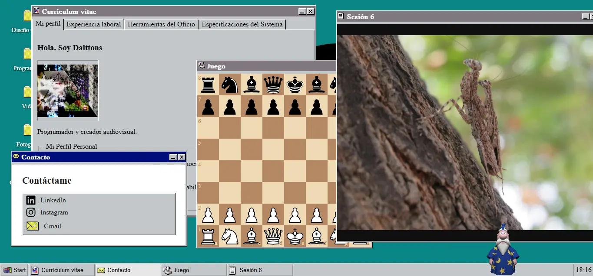

# Windows 95 Themed Portfolio

 

## Description
An interactive web portfolio simulating the Windows 95 graphical desktop environment. Designed to deliver a nostalgic experience while showcasing projects, technical skills, and professional experience. The environment features overlapping window management, a functional start menu, and a global state system to emulate the behavior of classic applications.

## Technologies & Libraries

* React
* TypeScript
* Vite
* Zustand (Window state management)
* Pure CSS / CSS Modules

## Local Installation & Execution

To replicate or run this project in your local environment, ensure you have [Node.js](https://nodejs.org/) installed.

1. Clone the repository:
```bash
git clone [https://github.com/dalttons/Windows-95-Portfolio.git](https://github.com/dalttons/Windows-95-Portfolio.git)

## Credits and Attribution

This project is a modified fork of the original architecture developed by [@alishirani1384](https://github.com/alishirani1384/win95-portfolio).

**Modifications and refactoring introduced in this version:**

* Dynamic data injection for showcasing a personal portfolio (Graphic Design and Audiovisual Production).
* Implementation of **Code Splitting** (`React.lazy` and `<Suspense>`) to isolate the heavy loading of Base64-encoded dependencies.
* Mitigation of native touch event issues (*touch-action bypass*) and resolution of layout constraints in flexible containers to improve mobile device compatibility.
* Removal of obsolete dependencies and reduction of technical debt within the rendering tree.
